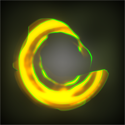
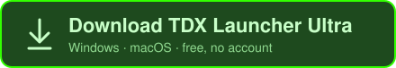

  

<h1 align="center">TDX Launcher Ultra</h1>

  Your always-on TouchDesigner launcher: session control, Patreon-as-Palette and much much more. 
  Every <code>.toe</code> opens in the build it was saved with. Free, no account.

  

  Windows 10 and up · macOS on Apple Silicon (signed and notarized) 
  <a href="https://launcher.functionstore.tools/docs/">Documentation</a> ·
  <a href="https://launcher.functionstore.tools/demo/">Try it in the browser</a> ·
  <a href="https://www.patreon.com/function_store/join">Support on Patreon</a>

## What it does

**Launching**
- Opens every `.toe` in the TouchDesigner build it was saved with, and offers to install a build you're missing.
- TouchDesigner's own recents and the launcher's history in one gallery or list, with tags, per-project README notes and preview clips that play on hover.
- All versions of a project (numbered saves, `Backup/` copies, crash autosaves) fold into one card with a versions drawer.
- Templates (startup files) on number-key shortcuts; double-click any `.toe` on your system and it routes through the launcher.

**Running sessions**
- Every running TouchDesigner, including ones you opened elsewhere: focus, save, update the thumbnail, record a preview video, relaunch or kill.
- A status dot on each session (running, not responding, ended); an ended session relaunches in one click.
- Heartbeat watchdog: relaunches a stalled show, with optional email alerts.
- Live CPU, RAM, fps and GPU readout per session, a switcher for every TouchDesigner window, and on Windows, binding a project to one GPU and its windows to the right displays.

**Quick Launch**
- One global hotkey opens a search box over everything: projects, sessions, components and commands, forgiving typos and ranking what you use most.
- Drag any `.tox` straight from it into a TouchDesigner network.

**Components**
- Your palette folders, plus a Toolbox of favourites from local files, URLs or GitHub releases, dragged in or placed into a running session in one click.
- The FNSTools catalog: browse, install into a project, and edit every tool's settings. Most tools are free; Plus tools come with a [Patreon membership](https://www.patreon.com/function_store/join).
- The Patreon tab: posts from the creators you support, with their `.tox` / `.toe` files one drag away.
- Install a PyPI package into a project's Python environment in one click.

**Projects**
- Git panel: changes, diffs, commits, branches, push and pull.
- Back up a project to a USB drive, a synced folder, or Google Drive, Dropbox, OneDrive or Box. Backups never delete anything.

**From anywhere**
- A phone page over Wi-Fi to launch, focus, relaunch or kill sessions.
- The launcher's tabs inside TouchDesigner's own Palette Browser.
- Updates itself, checking once a day and never while a session is running.

Every feature in detail: [the docs](https://launcher.functionstore.tools/docs/).

---

## Building from source

Tauri 2 (Rust) with a React + TypeScript front end. Setup, dev, build and release notes are in [DEVELOPMENT.md](DEVELOPMENT.md). MIT licensed, see [LICENSE](LICENSE).

---

## Report a bug or suggest a feature

[Open an issue](../../issues/new/choose). Everything else — downloads, docs, release notes — lives on
[launcher.functionstore.tools](https://launcher.functionstore.tools).

Before reporting a bug:

1. **Update first.** Help ▾ → About & updates → Check for updates. The app updates itself.
2. **Attach the log** (drag the file into the issue):
   - macOS: `~/Library/Logs/xyz.functionstore.tdxlu/tdxlu.log`
   - Windows: `%LOCALAPPDATA%\xyz.functionstore.tdxlu\logs\tdxlu.log`
